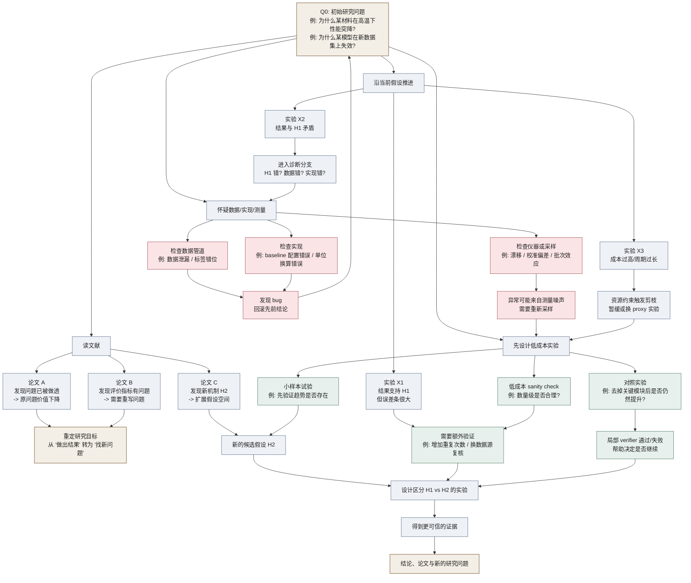
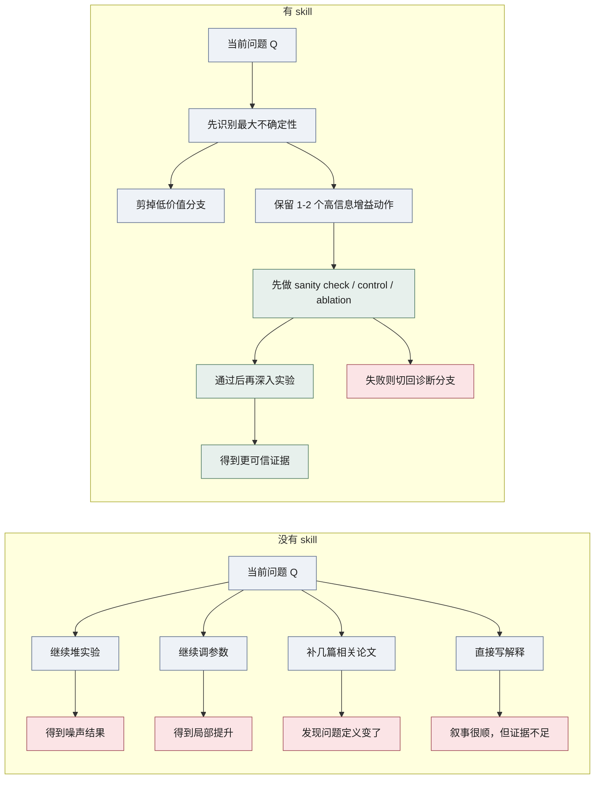
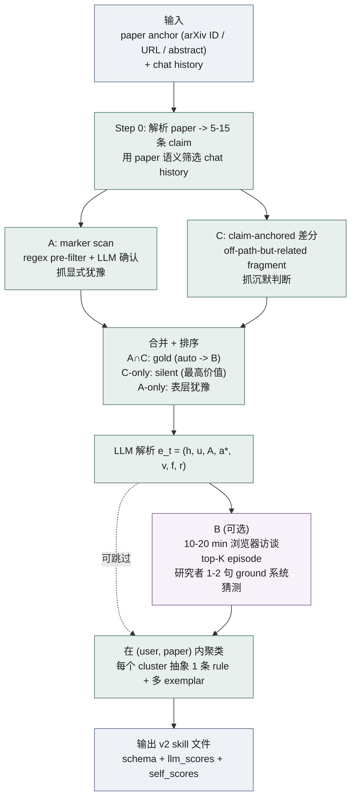
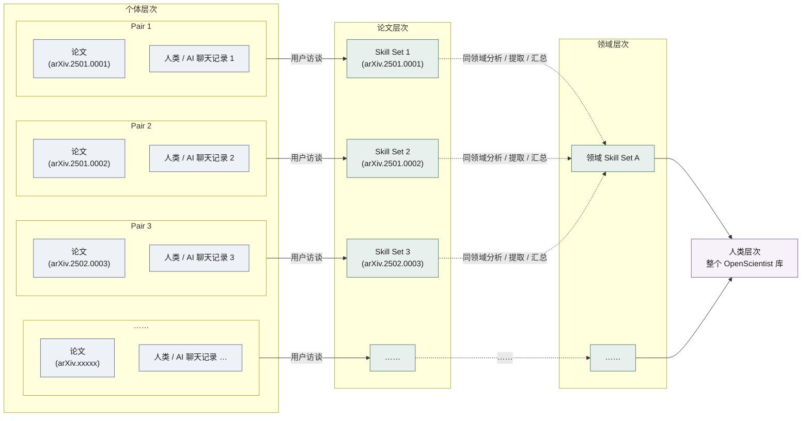

# 为什么科研是困难的，以及我们需要什么样的 Research Skills

这是一份 problem statement。它的具体目的是把一件事说清楚——OpenScientist 的 `/extract-knowhow` v2 应当被设计成什么样——同时把这件事所依赖的几个前提，按七个连续问题摊开来。

1. [为什么科研本身如此困难](#q1-为什么科研是困难的)
2. [为什么大模型并未因此自然变成科研代理](#q2-为什么现在的大模型自动化科研效果不佳)
3. [人类研究者为什么仍然能在同样困难的环境里推进科学](#q3-人类为什么还能在这样的环境中做科研)
4. [如果想帮模型做科研，应该设计什么样的 skill](#q4-我们该设计什么样的-skills)
5. [应该用什么样的 rubric 衡量这些 skill](#q5-我们该用什么样的-rubric-来衡量这些-skills)
6. [如何从论文与研究者-AI 交互中提取这些隐性知识，并让 AI 真正用上它们](#q6-我们如何提取这些隐性知识并让-ai-真正使用它们)
7. [从个人 skill 出发，如何沉淀出领域级的 research skill layer](#q7-从个人-skills-到领域级-research-skills)

文章的核心立场：科研最稀缺的资源是帮助研究者在不确定中搜索、判断、校准、剪枝和恢复的隐性能力，而非更多公开知识。文中保留少量符号，但仅限于真正承担推理工作的部分；其余形式化已经删去。

## 一、为什么科研是困难的

科研困难的根源是结构性的。研究者面对的是未知世界本身——没有预先给定的规则，没有给定的目标，没有给定的检验器。自然不会预先告诉他哪些变量重要、哪些异常是噪声、哪些偏差指向真正的现象。研究是在几乎没有地图的前提下，在一个不断展开的可能性空间里摸索前进。

如果一定要做最低限度的形式化，可以把研究环境写成

$$
\mathcal{E} = (\mathcal{W},\ \mathcal{O},\ \mathcal{A},\ \mathcal{C}),
$$

其中 $\mathcal{W}$ 是世界本身，$\mathcal{O}$ 是研究者能够观察到的一切（实验数据、文献、审稿意见、共同体反馈），$\mathcal{A}$ 是可以采取的动作（读文献、提出假设、设计实验、修改实现、重写问题），$\mathcal{C}$ 是各种真实成本（时间、算力、实验预算、机会成本）。研究者并不能直接看到 $\mathcal{W}$；他真正拥有的只是到当前为止的研究历史

$$
h_t = (o_1, a_1, o_2, a_2, \ldots, o_t),
$$

并基于这个历史继续行动。这一点本身就说明了科研的形态——在信息不完整的前提下连续做选择。题面从来不是给定的。

把这件事画成树最直观。下面的每个节点都是一个局部研究状态 $h_t$；每条边都对应一个真实动作，例如继续读文献、设计区分性实验、检查数据管道、或重写问题本身。

这张图同时呈现了科研的几个结构性特征。树很宽——任何一个局部状态都会展开成许多看似合理的下一步。树很深——往往要走到几层之后才知道一开始是在逼近答案还是在浪费时间。树里充满回边和重写——发现 bug、读到新文献、遇到资源约束，都会把研究者送回前面某个节点，迫使整条搜索路径重排。最有价值的节点很少是终点；它们多数出现在中途——是那些能帮助研究者构造局部验证、区分 competing hypotheses、或及时剪掉坏分支的位置。

更困难的是反馈结构。在大多数成熟任务里，至少存在某种外部 verifier 能告诉你一步走得对不对。前沿科研里恰恰没有这种奢侈条件。一次"成功"可能只是偶然波动，一次"失败"可能只是 setup 错了；审稿人的否定不必然意味着结论错误，指标的提升也不必然意味着理解更深。研究者收到的信号普遍延迟、稀疏、含噪。

**科研是一种长时程搜索过程，发生在一个没有可靠全局 verifier 的环境里。**

科研还有一层别的搜索任务很少有的特征：目标本身会在过程中变化。一个最初看起来明确的问题，做着做着可能发现定义错了；一个看似次要的异常，后来可能成为真正的研究核心；一个原本依赖的指标，深入后会发现根本不能代表所关心的科学对象。许多重要的科学进展恰恰发生在观察结果违反既有期待的时候——但当一个结果违反期待时，它究竟意味着 bug、误差、污染、理论失效，还是真正的新发现，本身就是一个极难的判断。

正是在这一点上，科研高度依赖隐性知识。论文记录最后站得住脚的结论，却很少完整保存让研究者知道"现在该怀疑什么"、"哪类负结果其实有信息"、"什么时候该继续投入、什么时候该止损"的判断过程。真正高价值的研究经验很少是一句显式规则。它更像一种被失败、修正、惊讶和反复试探塑造出来的直觉结构——它体现为 search policy、heuristics、reasoning protocol 和 taste。

**顶尖研究者最珍贵的能力，是知道如何在搜索树里导航。**

## 二、为什么现在的大模型自动化科研效果不佳

接受了上面的描述之后，就不难理解为什么大模型并未自动解决科研问题。模型在许多任务上已经非常强，但它们最擅长的任务分布与科研最本质的结构性困难并不重合。模型擅长的是输入输出边界相对清晰、局部步骤可即时检验、训练语料中已经存在大量相似轨迹、错误成本不高且可快速重试的任务。前沿科研的形态正好相反：问题本身常常未被定义清楚，局部步骤难以立刻验证，成功路径在公开语料中既稀少又被高度压缩，错误的代价很高，常常要很久之后才显现。

最简单的写法是这样：标准语言模型优化的是"给定上下文，下一句最像什么"，而科研代理需要优化的是"给定当前研究状态 $h_t$，下一步最值得做什么"。前者对后者有帮助，两者却并不等价——一个系统完全可以非常擅长生成下一段流畅的话，却不擅长选择高价值的下一步研究动作。

**今天的大模型是强大的局部决策器，而非稳定的长时程研究搜索器。**

科研要求持续追踪长期目标、中间假设、已排除的分支、失败历史以及下一步动作的信息增益。当前模型的工作方式更接近对当前节点附近模式的高质量拟合。科研需要的是对整棵树的管理能力，模型默认更敏感的却是局部邻域的流畅展开。

这个错位在缺少 verifier 的场景里会被放大。模型完全可以写出结构完整、措辞严谨的 paper-style 段落——但"讲得顺"不等于"判断得对"。在没有外部检验器的地方，重要的是知道何时保持犹豫、何时构造额外验证、何时承认证据不足、何时把一个漂亮解释先降级成待检验假设。当前模型在这些位置经常会漂向一个语言上更圆满、逻辑上未必更可靠的答案。它们能高质量模仿 polished outcome，却很少真正拥有通向 outcome 的 search policy。

这与训练数据本身的结构有关。公开论文和技术报告更接近研究结果的压缩表示，而非研究过程的完整录像。语料里最容易看到的是最终结论、整理过的实验设计、被修饰过的贡献叙事——很少看到研究者如何在混乱中排查异常、如何在失败中重构问题、如何因为某个不对劲的现象而改变整个路线。模型大量见过"研究完成之后是什么样子"，却很少见过"研究正在进行时是什么样子"。它学到的是 scientific language，而非 scientific search。

资深研究者知道某类训练不稳定多半是数据管道问题、某类异常十有八九来自仪器误差、某类解释虽然漂亮却几乎总是错的。这种判断来自他们在真实成本约束下反复经历失败、回收失败、更新路径——单靠读某段定义无法获得。模型当然也见过很多关于失败的描述。描述失败和被失败雕刻是两件事。

## 三、人类为什么还能在这样的环境中做科研

一个自然的问题是：既然环境如此不友好，大模型又在这些困难前暴露出短板，那么人类研究者为什么仍然能在同样条件下推进科学？答案当然不是人类拥有某个完美算法。科研的慢、贵、充满失败本身就说明人类同样不擅长在这种环境里行动。区别在于另一件事——人类在长期实践中发展出了一整套应对机制。这套机制分布在个体认知、训练经历、外部工具、社会协作和学术制度之中，共同构成一个 research skill stack。

所谓"知道下一步该怎么走"，是 research intuition 的结果——长期阅读文献、长期面对失败、长期在具体项目中修正理解之后形成的判断模式。这种 intuition 不是神秘主义，它是大量局部模式在经验中的沉淀：什么样的问题通常只是技术噪声，什么样的结果虽然显著却不值得发表，什么样的异常值得多看一眼，什么样的 baseline 其实不诚实，什么样的实验设计最能区分 competing hypotheses。这一点与 Polanyi 所说的 tacit knowledge 几乎是同一回事——我们知道的总是多于我们能说出口的。

人类还会在失败中真正更新自己的局部世界模型。失败对研究者来说是会重塑后续判断的事件，远不止"结果不佳"这一句描述。一次不可复现的结果会改变你对测量流程的看法；一次糟糕的 ablation 会改变你对模型机制的理解；一次审稿意见可能迫使你承认原先的问题 framing 就错了。研究者之所以会逐渐变得可靠，靠的是把失败转化为后续搜索的结构——失败本身并未减少。

更重要的是，人类不会被动等待最终奖励，而是主动构造局部代理信号来缩短反馈回路。因为没有全局 verifier，研究者就自己制造局部 verifier：sanity check、对照、ablation、数量级估算、独立数据源交叉验证、边界情形检查。

**人类之所以能做科研，一个关键原因是：研究者不仅接受信号，还会主动设计信号。**

沿着第一章的符号继续写，研究者真正在做的事是在过程中不断搭建一组局部检查 $v_1, v_2, \ldots, v_k$，而非等待一个本不存在的全局 $V$。这些检查都不完美，但它们让研究者不必把所有判断推迟到一个很晚才出现的最终结果上，能够在搜索途中持续校正自己对问题的理解。

人类还依赖 scientific taste 做高维剪枝。科研最稀缺的资源是注意力、时间和实验预算——可行路径反而从来不缺。一个优秀研究者之所以重要，关键能力是更快地判断哪些问题虽然能做但不值得做、哪些结果虽然显著但科学意义贫乏、哪些路线虽然技术上成立却会浪费半年时间。这种 taste 难以完全形式化，却真实存在于科研共同体的训练与评价之中。它帮助研究者在极宽的搜索树上大幅减少无效分支，让搜索变得勉强可承受。

人类的科研能力从来都是一种 distributed cognition，而非单个大脑的能力。研究者借助笔记、草稿、代码仓库、图表、实验记录、组会、合作者、导师、同行评审与学术共同体来维护一个跨时间、跨个体的搜索过程。学术制度虽然远不完美，但可复现性要求、同行评审、引用与反驳、独立团队的重复验证，仍然构成一个缓慢、粗糙、却重要的纠偏系统。

最后，人类会真正承担错误的成本，而成本本身会塑造判断。时间、实验、声誉、机会、误判异常带来的发现损失，都会反过来影响一个研究者的证据标准、谨慎程度与排查顺序。许多"直觉"之所以可靠，是因为它被真实代价反复训练过——研究者的判断扎根在真实经验上，而非漂浮在语言层面。

## 四、我们该设计什么样的 Skills

如果前三章成立，那么真正能帮助模型做科研的，就不会只是更长的上下文窗口，也不会只是把更多论文塞进知识库。我们需要的是另一层东西——一层更接近人类 research skill stack 的中层结构。它的本体是可复用的 policy、heuristic 和 protocol，能直接改变研究行为。OpenScientist 要收集和组织的，是"在这个领域里，研究者如何在不确定中推进问题"，而非"这个领域知道什么"。

可以把一个 research skill 理解成作用在当前研究状态 $h_t$ 上的中层映射：

$$
\sigma(h_t) \;\rightarrow\; \{\text{保留哪些分支},\ \text{先做什么},\ \text{要做哪些局部检查},\ \text{失败后怎么重排}\}.
$$

skill 的本体是一个能改变搜索结构的东西。它告诉你哪些路先不要走、哪些路值得优先试、哪些地方必须加 check、以及如果结果不对劲，下一步该怎么调整。

**真正有价值的 skill 必须能让 agent 在面对搜索分支时产生不同的决策序列。**

skill 对搜索过程的影响可以画成下面这样。左边是没有 skill 的树，右边是 skill 介入之后的树。skill 改变的是树的形状，它不会替你跳到终点。

这张图想说明的是 skill 如何改变搜索树的几何结构：让低价值分支更早被剪掉，让"先做局部验证再决定是否深入"这种研究经验嵌入流程本身。它不会神奇地给出正确答案。

skill 的设计应当直接对应科研的结构性困难。既然科研难在搜索空间大、路径长、反馈弱、噪声高、缺少 verifier、强依赖 taste，skill 也应当正面处理这些问题。这意味着我们需要的是一组功能互补的 skill 类型：帮助缩小问题、排序分支、识别真正关键文献与假设的（处理搜索宽度）；在结果异常、实验失败、信号模糊时做系统诊断的（处理噪声与误判）；专门教 agent 构造局部 verifier 的，例如 sanity check、对照、ablation、数量级检查、独立复核（弥补全局验证的缺失）；偏 exploration、taste 与 orchestration 的，帮助 agent 识别当前最大不确定性来源、选择信息增益最高的动作、并在多轮工具调用与多种表示之间维护一个长期一致的研究状态。

### 一个高价值 skill 的几个层

- **Trigger** —— 它在什么样的研究情境下被调用？没有触发条件的 skill 无法稳定进入真实工作流。
- **Decision** —— 它在哪个不确定性面前做选择？它选了什么动作？它显式拒绝了哪些备选，理由是什么？这是 skill 的核心。线性流程不算决策。
- **Local verifiers** —— 它要求 agent 在执行过程中构造哪些自检？至少一条具体可执行的。
- **Failure handling** —— 当自检失败、当行动不奏效时，下一步是什么？只覆盖 happy path 的 skill 在真实科研里几乎一定会崩。
- **Anti-exemplars** —— 哪些情境看起来像但其实不适用？这是 skill 能不能被正确调用的关键信号。
- **Domain knowledge**（受限）—— 一类例外的字段，下面单独讨论。

### 关于 Domain Knowledge：唯一应当被保留的"知识"

第一直觉可能是 skill 不应当包含任何知识字段——知识容易退化成教科书摘要，而教科书内容对于一个有训练数据的 LLM 是冗余的。但这是过度简化。在前沿研究的真实部署里，模型缺的从来都是另外三类知识，而非教科书层面的常识：

1. **Frontier** —— 训练截止之后才出现的方法、参数、benchmark、机制解释。例如某个 reagent 的最新替代品、某个 dataset 在 2025 年才被发现的 leakage、某个 baseline 在某个 domain 上的最新调参值。
2. **Non-public** —— 实验室内部的、未发表的、口口相传的细节。某个 vendor 的器件批次差异、某个 setup 在组里的踩坑记录、某个 protocol 在实操中的关键 implicit step。
3. **Correction** —— 对 LLM 默认信念的纠偏。模型在某个领域里有一个常见但错误的"先验解释"，skill 必须显式标出它，否则 agent 会一遍遍踩同一个坑。

这三类是 LLM 即使读完所有训练数据也不会拥有的东西。它们应当进入 skill schema 里的 `domain_knowledge` 字段，每条都标明 source type；不属于这三类的内容则不应进入。

**`domain_knowledge` 是模型在 deployment 时具体缺什么的清单，而非一个一般意义上的知识库。**

反过来说，什么不应该被叫作 research skill 同样重要。教科书摘要不是 skill——它复述公开显式知识。通用写作建议不是 skill——它不直接改变科研搜索。与具体领域无关的 prompt trick 也不是 skill——它无法替代 taste、失败诊断和局部 verifier 的构造能力。一条只是"上次成功时做了什么"的项目笔记，也不是 skill——它没有抽象出适用条件、失效边界和迁移原则。一个理想的 research skill 是某个领域中能稳定改善行动选择、搜索效率、判断质量和失败恢复的中层能力模块——它的角色是通向答案的一段可复用导航，而非答案本身。

## 五、我们该用什么样的 Rubric 来衡量这些 Skills

把 skill 看成对搜索过程的干预之后，评分标准也得跟着变。一份糟糕的 rubric 奖励篇幅、术语密度、权威口吻和百科式完整度，把"看起来像专家写的"误当成质量。可一个 skill 真正的价值在于能否让 agent 在研究树里走得更像研究者，这件事和"读起来像不像专家"几乎没有关系。

**Rubric 衡量的是 skill 改变行为的能力，而非它阅读起来的样子。**

要让评分这件事不停在主观印象上，rubric 需要满足两个工程性条件：每一个维度都对应 schema 里的一个具体字段，以及评分本身可以由多个独立来源给出。前者保证 LLM-as-judge 可以靠"检查字段"打分，而非靠"理解精神"；后者保证我们不会在某一类评分上塌方。

### 7 个维度

| # | 维度 | 它在问什么 | 对应 schema 字段 |
|---|---|---|---|
| 1 | Actionability | agent 是否一读就能动手？ | `when` + `decision.preferred_action` |
| 2 | Decision specificity | 这是判断还是流程？是否显式拒绝了某些备选？ | `decision.rejected_alternatives` |
| 3 | Local verifiers | 是否携带可执行的自检？ | `local_verifiers` |
| 4 | Failure handling | 是否覆盖 off-nominal 路径？ | `failure_handling` |
| 5 | Tacit-knowledge density | 是否携带 LLM 训练里没有的东西（前沿 / 非公开 / 纠偏）？ | `domain_knowledge` |
| 6 | Groundedness | 抽象规则能否 trace 到一个具体 episode？ | `## Exemplar` + `source` |
| 7 | Transferability | 同子领域里其他人用得上吗？边界条件清楚吗？ | `when.exclusions` + `anti_exemplars` |

每一维 0–5 分。早期草稿里还讨论过 calibration 和 long-horizon utility 两维，它们在 v0 阶段缺乏可靠的自动信号，先放下，等 peer review 数据攒够再加回。

### 3 个评分层

同一份 7 维 rubric，由三种独立来源各自打一遍。三组分数分开存在 schema 的 `confidence` 下面，不合并成总分。

- **`llm_scores`** —— 抽取时由一个 LLM judge 自动完成。便宜、即时、可重跑。每次 v2 抽取算法改一次，就在内部 corpus 上重跑这一层，看分布有没有退步。这就是上一稿里那个写不出来的 $\mathbb{E}[J \mid \sigma] > \mathbb{E}[J]$ 判据，被换成了一个真正可计算的代理。
- **`self_scores`** —— 提交者自己在 B 访谈结束前花两分钟打的分。主观，但和原始判断离得最近。
- **`peer_scores[]`** —— 同领域 reviewer 的打分，可以多人。最慢、最权威，留给社区流程。

合并这三层会消掉它们之间的差异，可差异本身才是最有信息量的部分。LLM 给一条 skill 5/5、提交者只给 2/5，说明 LLM 被语言流畅性骗了——这正是 Ch2 警告过的那种失败模式。这种 skill 应当自动进入 reviewer 队列优先复核。

**三层之间的不一致是 rubric 系统的主要 signal，而非噪声。**

这套 rubric 把"如何判断 skill 好不好"从一个抽象的哲学问题，变成可以一行行检查、可以在算法迭代时跑 CI、可以暴露 LLM 自己被骗的工程问题。它不能保证选出来的 skill 一定有用，但至少能保证我们看到的"高分 skill"和"低分 skill"之间确实在做不一样的事。

## 六、我们如何提取这些隐性知识，并让 AI 真正使用它们

如果前五章成立，那么最后一个问题几乎不可避免：既然科研最稀缺的是隐性知识，那么这些东西究竟从哪里来，又该如何被保存、抽取并重新部署给 AI？如果答案只是"请专家手写总结"，这件事虽然有价值，却很难规模化。OpenScientist 真正要解决的问题，是找到一种从研究已经留下的痕迹里恢复 search policy 的方法。

今天值得利用的痕迹至少有两类，彼此互补。一类是论文、技术报告、补充材料、代码仓库和实验记录这种 outcome trace；它们记录了什么问题被认为值得做、什么证据被认为足够强、什么实验设计最终被保留下来。另一类是研究者与 AI 的交互、笔记、排查记录、反复改写的问题表述和工作流中的即时判断，这些更接近 process trace；它们暴露了研究真正推进时的犹豫、怀疑、回滚、比较和局部决策。前者告诉我们"最后站住脚的是什么"，后者告诉我们"在站住脚之前是怎么想、怎么试、怎么改的"。

**真正的 tacit knowledge 往往藏在 outcome trace 与 process trace 的差分里。**

提取的目标是从这些材料背后反推一个稳定的中层策略，而非复述材料本身。我们想恢复的是一个在状态 $h_t$ 下能够影响下一步动作选择的 skill $\sigma$，而非某篇论文说了什么或某段对话逐字说了什么。这件事的难点是抽取 policy，文字本身的抽取相对容易。

下面是 `/extract-knowhow` v2 的具体设计。它把上面这个目标拆成四个组件——A、C、B 和一个最终的聚类层——并由一个 Step 0 的纸驱动语义筛选作为入口。

### Step 0：纸驱动的语义筛选

研究者输入一个 paper anchor。它可以是一个 arXiv ID、一个 paper URL，或者最低限度——一段研究者自己写的 200 字 abstract。系统首先解析这个 paper：如果是 arXiv，fetch 全文（PDF 或 LaTeX source）并抽出 5–15 条原子级 claim（每个方法选择、每个实验、每个结果、每个 baseline 对比是一条）；如果只有 abstract，claim 数量降到 3–5 条但流程不变。

随后系统用这个 paper 作为语义查询，把研究者的 chat 历史筛选成一个候选 session 集合。这一步只用 paper 做 query——研究者不需要手动选 session，也不需要给时间窗。

这个设计接受一个明确的风险：早期还没定题的探索性对话主题尚未与最终 paper 对齐，会被语义筛选漏掉。这恰恰是 Ch1 提到的"很多突破来自一开始没看出意义的异常"那一类。补救由后面 B 的访谈承担——访谈最后一题永远是"有没有一段早期探索 session 我们没扫到"，让研究者人工把它们补回。

### A：marker-driven 标记扫描

A 在过滤后的 chat 上做一遍便宜的扫描。它维护一个中英文的 marker 词表：犹豫（hmm / wait / actually / 其实 / 等等）、覆盖（不对 / no, instead / 换个思路）、转向（让我先 / let me back up）、验证插入（先确认 / before X let me first）、怀疑（这不对劲 / suspicious）、意外（诶 / huh）、止损（不行 / this isn't working）。正则做 pre-filter 圈出候选窗口，然后对每个窗口调一次 LLM 确认它是否真的是一个决策时刻——这种 cheap recall + expensive precision 的两段式比纯 LLM 扫描便宜得多，比纯正则覆盖率高得多。

A 能抓到的，是研究者用语言留下了痕迹的判断。

### C：claim-anchored 差分

C 在同一份过滤后的 chat 上做一件不同的事。它把每个 chat 片段对照 Step 0 抽出的 paper claim 列表分类：matches-claim（在论文里）、off-path-but-related（讨论的是 paper 同主题，但任何 claim 都不匹配）、irrelevant（无关）。off-path-but-related 这一类就是候选的"暗判断"——研究者明明探索过，却没有在论文里留下痕迹。

对每一个这样的差分点，系统再调一次 LLM 生成一个 hypothesis："paper 没有保留这条路径，研究者大概率剪过它，理由可能是 X。"这是一个猜测，需要被 ground——这件事由 B 完成。

C 能抓到的，是研究者探索过、但在他自己脑子里已经被沉默地剪掉、连一个犹豫词都没留下的判断。

### A 和 C 的合并

A 和 C 在过滤后的 chat 上并行运行。它们的候选 episode 被合并、去重、排序。合并的时候有一个反直觉但重要的规则：

- **A∩C（gold episodes）** —— 两边都命中。语言痕迹和 paper-chat 差分一起指认同一个时刻，这几乎一定是真实的转折点。自动进入 B 的访谈队列。
- **C-only（silent decisions）** —— 只在 C 命中。研究者做了判断，但语言上没留任何痕迹——这意味着这个判断已经被内化到他自己都没意识到的程度，正是 tacit knowledge 最浓的地方。这一类的优先级**最高**。
- **A-only（explicit hesitations）** —— 只在 A 命中。语言上很犹豫，但 paper 把这条路径保留了——往往是表层的反复，价值不如前两类。

**研究者越没有意识到自己做了判断，那个判断就越值得抽取。**

### B：可选的深度访谈

合并后的 episode 列表先被 LLM 解析成一个结构化的 e_t 七元组：

$$
e_t = (h_t,\ u_t,\ A_t,\ a_t^*,\ v_t,\ f_t,\ r_t),
$$

其中 $h_t$ 是研究状态，$u_t$ 是当前最核心的不确定性，$A_t$ 是候选动作，$a_t^*$ 是被选中的动作，$v_t$ 是为这一步构造的局部 verifier，$f_t$ 是典型失败信号，$r_t$ 是失败后的 recovery。

如果研究者愿意花 10–20 分钟，可以进入 B 访谈：v2 在浏览器里展示 top-K 个 episode（A∩C gold 优先，C-only silent 次之），每个 episode 三栏显示——chat 摘录 / 系统抽到的 paper claim / 系统对"被否决备选"的 hypothesis。研究者在每个 episode 下面填 1–2 句话。这些回答会反向 reshape 已经解析出的 e_t，并在 schema 里留下一个 researcher-voice 的注释。

B 是可选的，但它是把 C-only 的"系统猜测"变成"研究者真实判断"的唯一可靠方式。如果跳过 B，C-only episode 仍然会被保留，但 confidence 字段会被标记为未经访谈确认。

### 聚类、抽象与输出

经过 e_t 解析（和可选的 B 访谈）之后，episode 在同一个用户、同一篇 paper 内做聚类——相似的 episode 合并成一组，每组抽象出一条 decision rule，并保留 1–2 个 grounding exemplar。跨用户、跨 paper 的聚类不在这里做，那是第七章的事。

输出是若干个 v2 skill 文件，每个文件遵循 Ch4 给出的 schema，由 Ch5 的 7 维 rubric 自动打分（`llm_scores` 这一层）。研究者在浏览器里 review 一遍，提交到 GitHub。

整个 pipeline 长这样：

### skill 在 v2 里的角色

值得专门指出的一件事：在 v2 里，skill 不只是被放进知识库等 agent 偶尔顺手引用的参考资料。它的角色更接近 policy module。一个更贴近实际的运行方式是

$$
h_t \;\xrightarrow{\text{retrieve}}\; \{\sigma_i\}
\;\xrightarrow{\text{compose}}\;
(\text{next action},\ \text{required checks},\ \text{fallback plan}),
$$

而不是简单的 "retrieve 一段背景知识，再让模型自由发挥"。也正因为如此，v2 schema 里 `when` / `decision` / `local_verifiers` / `failure_handling` 这些字段必须是结构化的、可以被 agent 在 runtime 直接读取的，而不能只是说明文里的几个段落。

OpenScientist 最终积累的是一批能嵌入研究闭环的 policy artifact，而非一堆"像专家写的说明文"。好的 skill 会迫使 agent 在该谨慎时谨慎、在该做 sanity check 时先不急着解释、在 evidence 不够时保持未决、在出现异常时优先走最有信息增益的诊断路径。

**目标是让 AI 在研究树里走得更像研究者，而非表面上更像研究者。**

## 七、从个人 Skills 到领域级 Research Skills

> **本章超出 v2 的范围。** v2 只在同一用户、同一 paper 内做聚类。本章讨论的领域级 skill 形成机制是 OpenScientist 的长期方向，它依赖大量个人 skill 的积累，以及共同体审稿与版本化机制的成熟，至少要等 v2 跑一段时间之后才有可能进入实施阶段。这里把它写下来，是为了让 v2 的设计选择和长期方向之间留出明确的接口。

如果第六章解决的是从单一研究者的论文与对话中恢复个人级 research skill，那么接下来的问题是：这些局部的、强情境依赖的 skill，如何沉淀成一个领域中更稳定、更可复用的 skill layer？OpenScientist 如果只停在个人 skill，它仍然只是一个高质量的经验仓库，距离一个真正能积累 scientific capability 的基础设施还有一段。

最初被提交上来的 skill，几乎一定会强烈依赖某篇论文、某个项目、某种数据、某套实验约束。这是一个起点，而非缺陷。隐性知识最早出现时本来就嵌在具体研究动作中：为什么这一步先查数据后改模型，为什么看到这个异常先怀疑 benchmark 后写解释，为什么在证据还不够时宁可延后 claim 也不急着推进。抽象原则是后来才浮现的。如果一开始就要求研究者直接写出与具体项目无关的领域级 skill，结果往往是太干净、太平、太像教科书的总结——离能改变研究行为的 search policy 还很远。

更现实的路径是先收集大量个人与项目级的 skill，再从它们之间的重复、差异、冲突和边界中，逐渐恢复更高层的稳定结构。如果写成一个最简符号，它更像

$$
\{\hat{\sigma}_1, \hat{\sigma}_2, \ldots, \hat{\sigma}_n\} \;\Longrightarrow\; \Sigma_{\text{field}},
$$

其中每个 $\hat{\sigma}_i$ 都来自具体论文、具体项目，而 $\Sigma_{\text{field}}$ 是更高层抽出来的领域级 research skill layer：它保留这个领域里反复出现的 decision pattern、diagnostic order、evidence threshold、常见伪信号、局部 verifier 习惯，以及在什么条件下应该重写问题而不是继续堆实验。$\Sigma_{\text{field}}$ 是一个在更高层次上抽出来的 pattern，与 $\hat{\sigma}_i$ 的并集和"把相似句子做平均"都不一样。

也正是在这里，科学共同体不再只是背景，而开始成为 skill 形成机制的一部分。单个研究者的 skill 告诉我们"在这个项目里他是怎么走的"，但很多决定研究质量的东西并不会在单个 episode 中完整出现。什么样的问题在这个领域里算重要、什么样的结果虽然显著却仍不够 convincing、什么样的异常会被当作噪声、什么样的异常值得顶住压力继续追、什么样的证据标准足以让一个 claim 进入共同体——这些判断往往是在长期训练、论文写作、组会讨论、审稿互动、复现实践和学术争论中逐渐稳定下来的，而非个人独自发明。领域级 skill 本质上带有共同体结构。

借用 Kuhn 的说法，一个领域级 research skill 与其说是脱离历史和共同体的普适规则，不如说是某个 paradigm 之内逐渐稳定下来的研究做法。范式不只是决定研究者相信什么理论，它还决定哪些 puzzle 被视为正当、哪些方法被认为严肃、哪些证据被认为足够、哪些异常暂时可以放在一边、哪些异常必须迫使我们停下来重写问题。OpenScientist 在走向领域级 skill 时，目标是把这些 skill 的适用边界、默认前提、证据标准和异常处理方式一并保存下来，而非假装提炼出完全无条件、无语境的元规则。一个高质量的领域级 skill 不只告诉 agent "下一步做什么"，也告诉它"在什么范式下，这样做才是负责任的"。

借用 Polanyi 的说法，这一步之所以必须经过大量个人 skill 的汇聚，正是因为真正的研究分辨力并不会在单个研究者的一次自我解释里被完整说出。我们知道的常常多于我们能直接说出的。资深研究者当然可以回顾自己为什么做了某个判断，但他们真正可靠的地方，是已经在长期训练中形成了稳定的 noticing、hesitation、calibration 和 evidence discrimination；这种能力不一定能被列成一组抽象规则。OpenScientist 因此不应把"让研究者提交 skill"理解成一次性写出最终答案，而应把这些个人 skill 看作进入 tacit knowledge 的多个切面：有的保存了 exemplars，有的暴露了 anti-exemplars，有的显示了证据门槛，有的记录了失败恢复。只有把这些切面放在一起，领域级的研究分辨力才会开始浮现。

领域级 skill 的表示形式因此不能只是更长、更完整的 protocol。它还应该保留一组能够支撑判断的结构：哪些 exemplars 说明这套 skill 在何处真正有效，哪些 anti-exemplars 提醒 agent 不要误用，哪些 warning signs 表明当前异常更可能是 artifact，哪些 evidence thresholds 决定现在应该继续推进还是先降级 claim，哪些 escalation conditions 意味着应当请人类研究者介入。

**领域级 skill 是把共同体长期训练出来的研究分辨力压缩成 AI 可以调用的脚手架，而非把个人经验洗成一套去语境化的说明文。**

从 OpenScientist 的建设路径看，这给出一条自然的分层路线。第一层是个人与项目级 skill 的广泛提交，它们是最贴近真实研究过程的原材料；第二层是领域内的聚类、比对与抽象，从大量相似或相反的 episode 中找出稳定 pattern；第三层是共同体评审与版本化，让领域级 skill 不只是技术聚合的结果，也接受来自真实研究共同体的纠偏与修正。

对 AI 而言，这种分层也很重要。个人 skill 更像局部专长模块，适合在高度相似的问题上提供强指导；领域级 skill 则更像默认的研究 policy layer，规定一个 agent 在进入新问题时应先用什么证据标准、怎样安排诊断顺序、何时保留异常、何时提高 verifier 密度、何时不应过早讲出一个完整故事。一个真正成熟的 scientific agent，理想状态下会同时受到领域级 skill 的约束，并在必要时叠加个人 skill 的细化补充——它是被多层 research skill stack 塑形的 agent，而非一个只会"引用技能"的检索器。

如果第六章讨论的是把隐性知识从研究痕迹中恢复出来，那么第七章真正要补的是这些局部 skill 如何继续上升为领域级研究能力。到了这一步，科学共同体、范式和个人知识不再只是解释性的哲学词汇，而开始直接决定 OpenScientist 的长期机制设计。它既要从个人研究轨迹中捕捉最原始、最鲜活的 tacit knowledge，又要允许这些碎片在共同体尺度上不断比较、校正、抽象和版本化。若这条路能走通，OpenScientist 最终保存的将是一个领域如何训练研究判断、如何组织证据、如何对待异常、又如何把这些能力逐渐传递给 AI 的动态系统，而非一堆个人 know-how 的集合。

下面这张图把这条路径压缩成最简形式：

