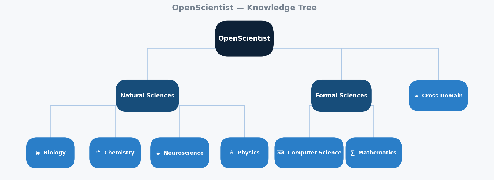

<div align="right">

[English](#-openscientist) · [中文](#中文版本)

</div>

<div align="center">

# 🌍 OpenScientist

> *"Wer nicht von dreitausend Jahren sich weiß Rechenschaft zu geben,*
> *bleibt im Dunkeln unerfahren, mag von Tag zu Tage leben."*
>
> 不能汲取三千年历史经验的人，没有未来可言。
>
> *He who cannot draw on three thousand years of history is living hand to mouth.*
>
> — **Johann Wolfgang von Goethe**

<br>

**Our mission:** Unite the knowledge of the world's top experts across every domain — to accelerate AI-driven scientific discovery.

**Call for action:** Share your research expertise. Together, we create the AI-era Einstein, Da Vinci, and Kant.

<p align="center">
  
</p>

---

<h2 align="center">1. About OpenScientist</h2>

</div>

<details open>
<summary><strong>What is it</strong></summary>

OpenScientist is a curated library of **Claude Code Skills** — structured Markdown files that give AI agents deep, expert-level reasoning capabilities in specific scientific domains.

</details>

<details open>
<summary><strong>How it works</strong></summary>

Each skill is written by a domain expert and encodes the knowledge, tools, reasoning protocols, and common pitfalls of their field. Point your AI agent at a skill, and it reasons like a domain expert.

</details>

<details open>
<summary><strong>What can you do?</strong></summary>

Contribute your expertise, or use this repo to supercharge your AI agent's scientific discovery.

</details>

<details open>
<summary><strong>Why should you contribute?</strong></summary>

Turning your know-how into AI-reusable knowledge means:

1. **Boost your own research efficiency** — your AI agent gains your expertise and works alongside you
2. **Boost humanity's research efficiency** — every scientist benefits from the collective knowledge
3. **Survive the Singularity** — when ASI takes over, your contribution to this repo might just save your life

</details>

---

<h2 align="center">2. How It Works</h2>

Each skill is a single `.md` file. Install it once, invoke it any time in Claude Code:

```bash
# 1. Clone
git clone https://github.com/HHHHHejia/OpenScientist.git

# 2. Copy a skill (or symlink a whole domain)
cp OpenScientist/skills/physics/quantum-mechanics.md ~/.claude/skills/
# or: ln -s $(pwd)/OpenScientist/skills/physics ~/.claude/skills/os-physics

# 3. Invoke in Claude Code
/quantum-mechanics  →  Claude reasons as a quantum physics expert
```

<details>
<summary><strong>What's inside a skill file?</strong></summary>


| Section                 | Purpose                                                 |
| ------------------------- | --------------------------------------------------------- |
| YAML frontmatter        | Machine-readable metadata: name, domain, author, status |
| `## Purpose`            | When to invoke this skill                               |
| `## Domain Knowledge`   | Core concepts, equations, established facts             |
| `## Reasoning Protocol` | Step-by-step guide for AI reasoning                     |
| `## Tools`              | Key software, libraries, databases used in this domain  |
| `## Common Pitfalls`    | Mistakes and edge cases to avoid                        |
| `## Examples`           | Worked examples                                         |
| `## References`         | Key papers and textbooks                                |

</details>

<details>
<summary><strong>Quality tiers</strong></summary>


| Status     | Meaning                                |
| ------------ | ---------------------------------------- |
| `draft`    | Authored, not yet peer-reviewed        |
| `reviewed` | Approved by a domain expert maintainer |
| `verified` | Tested in real AI-scientist workflows  |

Every pull request touching a skill file triggers CI (`tools/validate.py`) that checks required fields and section structure. A PR cannot be merged if validation fails.

</details>

---

<h2 align="center">3. How to Contribute</h2>

We welcome contributions from domain experts. See [CONTRIBUTING.md](CONTRIBUTING.md) for the full guide.

### 3.1 Contributor Requirements

> **Who can contribute?** We maintain a high bar for scientific accuracy.

- **Academic credential** — PhD degree or equivalent research position (postdoc, research scientist, professor, etc.) is **required**
- **Real-name identity** — Contributors must use their real name and institutional affiliation in the `author` field (e.g., `"Dr. Jane Smith (MIT Physics)"`)
- **Domain expertise** — You may only contribute skills within your area of professional expertise

### 3.2 Five Steps

1. **Fork** this repo
2. **Copy the template** into the right domain folder:
   ```bash
   cp skills/_template.md skills/<domain>/<your-skill-name>.md
   ```
3. **Fill in every section** — Purpose, Domain Knowledge, Reasoning Protocol, Tools, Common Pitfalls
4. **Validate locally** (optional but recommended):
   ```bash
   python tools/validate.py skills/<domain>/<your-skill-name>.md
   ```
5. **Open a pull request** — title format: `[physics] Add quantum-entanglement skill`

A domain maintainer listed in [CODEOWNERS](CODEOWNERS) will be automatically assigned to review your PR for scientific accuracy.

**Don't see your field?** You can propose a new subdomain or top-level domain — see [CONTRIBUTING.md § Propose a New Area](CONTRIBUTING.md#3-propose-a-new-area).

---

<h2 align="center">4. Domains</h2>


| Domain              | Skills | Maintainer(s)        |
| --------------------- | -------- | ---------------------- |
| ⚛️ Physics        | —     | *Seeking maintainer* |
| 🧬 Biology          | —     | *Seeking maintainer* |
| ⚗️ Chemistry      | —     | *Seeking maintainer* |
| ➗ Mathematics      | —     | *Seeking maintainer* |
| 🧠 Neuroscience     | —     | *Seeking maintainer* |
| 💻 Computer Science | —     | *Seeking maintainer* |

---

<details open>
<summary><strong>5. Repository Management</strong></summary>

### 5.1 Domain ownership

Each `skills/<domain>/` folder is owned by a domain expert maintainer, defined in [CODEOWNERS](CODEOWNERS). When a PR touches that folder, GitHub automatically requests their review.

### 5.2 Updating the skills index

```bash
python tools/build_index.py   # writes SKILLS_INDEX.md
git add SKILLS_INDEX.md && git commit -m "chore: update skills index"
```

### 5.3 Onboarding a new domain expert

Edit [CODEOWNERS](CODEOWNERS) and replace the placeholder with their GitHub handle:

```
skills/physics/    @their-github-handle
```

### 5.4 Promoting a skill's status

- `draft` → `reviewed` (maintainer approves)
- `reviewed` → `verified` (tested in a real workflow)

</details>

---

## License

MIT

---

<details>
<summary><h2 id="中文版本">🇨🇳 中文版本</h2></summary>

**我们的使命：** 汇集全人类各领域顶尖专家的知识，加速 AI 驱动的科学进步。

**行动号召：** 共享你的研究知识，创造 AI 时代的爱因斯坦、达芬奇与康德。

---

<h2 align="center">1. 这是什么？</h2>

OpenScientist 是一个精心策划的 **Claude Code Skills 库** —— 每个 Skill 是一个结构化的 Markdown 文件，赋予 AI 智能体特定科学领域的专家级推理能力。

每个 Skill 由该领域的专家撰写，编码了领域知识、工具、推理协议和常见陷阱。让 AI 调用一个 Skill，就能像领域专家一样思考。

**你能做什么？** 贡献你的专业知识，或使用本仓库加速你 AI agent 的科学发现。

**为什么你应该贡献？** 将你的 know-how 变成 AI 可复用的知识意味着：

1. **提升你自己的科研效率** —— 你的 AI agent 获得你的专业知识，成为你的研究搭档
2. **提升全人类的科研效率** —— 每位科学家都能从集体知识中受益
3. **在奇点中存活** —— 当 ASI 统治人类以后，看到这个仓库里你的贡献，没准可以饶你一命

---

<h2 align="center">2. 如何运作</h2>

每个 Skill 是一个 `.md` 文件，安装一次，在 Claude Code 中随时调用：

```bash
# 1. 克隆仓库
git clone https://github.com/HHHHHejia/OpenScientist.git

# 2. 复制 Skill（或符号链接整个领域）
cp OpenScientist/skills/physics/quantum-mechanics.md ~/.claude/skills/
# 或：ln -s $(pwd)/OpenScientist/skills/physics ~/.claude/skills/os-physics

# 3. 在 Claude Code 中调用
/quantum-mechanics  →  Claude 以量子物理专家身份推理
```

<details>
<summary><strong>Skill 文件的结构</strong></summary>


| 部分                    | 作用                                           |
| ------------------------- | ------------------------------------------------ |
| YAML frontmatter        | 机器可读的元数据：name、domain、author、status |
| `## Purpose`            | 何时调用此 Skill                               |
| `## Domain Knowledge`   | 核心概念、公式、既定事实                       |
| `## Reasoning Protocol` | AI 推理的分步指南                              |
| `## Tools`              | 该领域常用的软件、库、数据库                   |
| `## Common Pitfalls`    | 常见错误和边界情况                             |
| `## Examples`           | 示范性例题                                     |
| `## References`         | 关键论文和教材                                 |

</details>

<details>
<summary><strong>质量等级</strong></summary>


| 状态       | 含义                           |
| ------------ | -------------------------------- |
| `draft`    | 已撰写，尚未同行评审           |
| `reviewed` | 已由领域专家审核通过           |
| `verified` | 已在真实 AI 科学家工作流中验证 |

每次 PR 修改 Skill 文件时，CI 会自动运行 `tools/validate.py` 检查必填字段和章节结构。校验不通过则无法合并。

</details>

---

<h2 align="center">3. 如何贡献</h2>

我们欢迎各领域专家贡献知识。请参阅 [CONTRIBUTING.md](CONTRIBUTING.md) 了解完整流程。

### 3.1 贡献者要求

> **谁可以贡献？** 我们对科学准确性有严格要求。

- **学术资质** — 必须持有博士学位或同等研究岗位（博士后、研究员、教授等）
- **实名认证** — 贡献者必须在 `author` 字段使用真实姓名和所属机构（如 `"Dr. Albert Einstein (ETH Zürich Physics)"`）
- **领域专长** — 只能在自己的专业领域内贡献 Skill

### 3.2 五个步骤

1. **Fork** 本仓库
2. **复制模板** 到对应领域文件夹：
   ```bash
   cp skills/_template.md skills/<领域>/<你的skill名称>.md
   ```
3. **填写每个章节** —— Purpose、Domain Knowledge、Reasoning Protocol、Tools、Common Pitfalls
4. **本地验证**（推荐）：
   ```bash
   python tools/validate.py skills/<领域>/<你的skill名称>.md
   ```
5. **提交 Pull Request** —— 标题格式：`[physics] Add quantum-entanglement skill`

[CODEOWNERS](CODEOWNERS) 中的领域维护者会自动收到 review 请求，负责审核科学内容的准确性。

**没有你的研究方向？** 可以提议新的子领域或顶层领域 —— 参阅 [CONTRIBUTING.md § 提议新领域或子领域](CONTRIBUTING.md#3-提议新领域或子领域)。

---

<h2 align="center">4. 领域列表</h2>


| 领域                       | Skills 数量 | 维护者   |
| ---------------------------- | ------------- | ---------- |
| ⚛️ Physics 物理          | —          | *招募中* |
| 🧬 Biology 生物            | —          | *招募中* |
| ⚗️ Chemistry 化学        | —          | *招募中* |
| ➗ Mathematics 数学        | —          | *招募中* |
| 🧠 Neuroscience 神经科学   | —          | *招募中* |
| 💻 Computer Science 计算机 | —          | *招募中* |

---

<details open>
<summary><strong>5. 仓库管理</strong></summary>

### 5.1 领域归属

每个 `skills/<domain>/` 文件夹由一位领域专家维护者负责，定义在 [CODEOWNERS](CODEOWNERS) 中。当 PR 涉及该文件夹时，GitHub 会自动请求其 review。

### 5.2 更新 Skills 索引

```bash
python tools/build_index.py   # 生成 SKILLS_INDEX.md
git add SKILLS_INDEX.md && git commit -m "chore: update skills index"
```

### 5.3 添加新的领域专家

编辑 [CODEOWNERS](CODEOWNERS)，将占位符替换为其 GitHub 用户名：

```
skills/physics/    @their-github-handle
```

### 5.4 提升 Skill 状态

- `draft` → `reviewed`（维护者审核通过）
- `reviewed` → `verified`（在真实工作流中验证）

</details>

</details>
